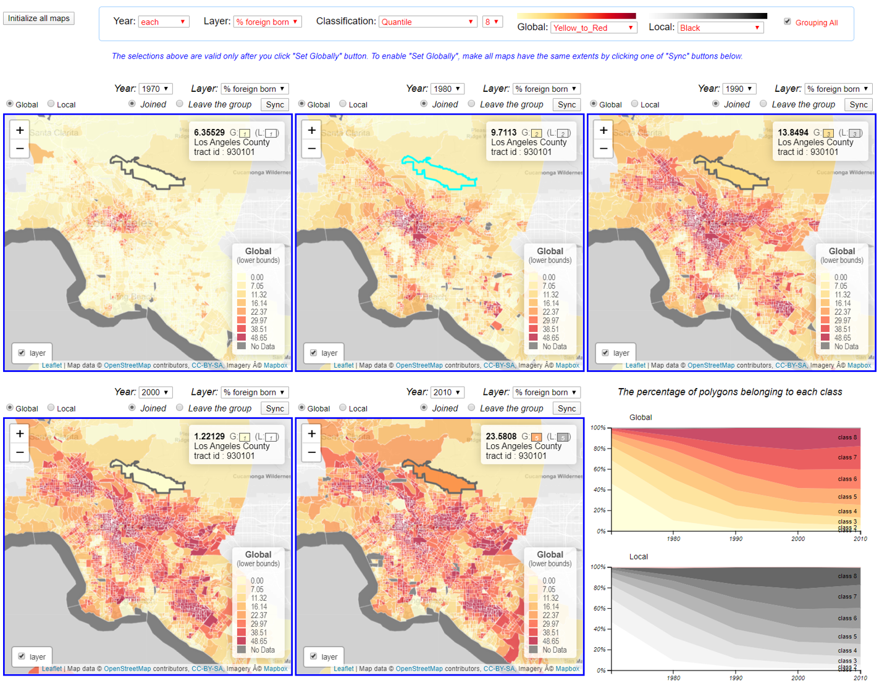

# Adaptive Choropleth Mapper (ACM)

<strong>Adaptive Choropleth Mapper (ACM) is an open-source mapping tool for the visualization of multiple choropleth maps, which provides the following functions.</strong>

<ol>
<li>An automatic way to compute and set the same class intervals across different choropleth maps</li>
<li>A paired visualization of choropleth maps, with both global and local classifications</li>
<li>Linking and brushing across multiple choropleth maps in terms of map extents and class intervals</li>
<li>A stacked chart representing the temporal change of each class in choropleth maps over time</li>
</ol>

For more information about ACM, visit the <a href="http://173.255.192.133/~suhan/ACM" target="_blank" rel="noopener">website of ACM</a>.&nbsp;&nbsp;

<a href="http://173.255.192.133/~suhan/LNE" target="_blank" rel="noopener">Longitudinal Neighborhood Explorer (LNE)</a> is an application using Adaptive Choropleth Mapper.

<strong></strong>

